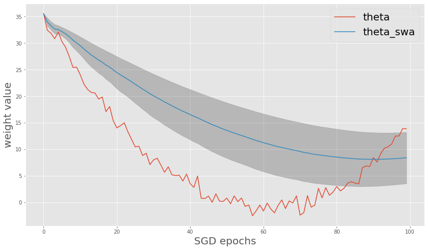
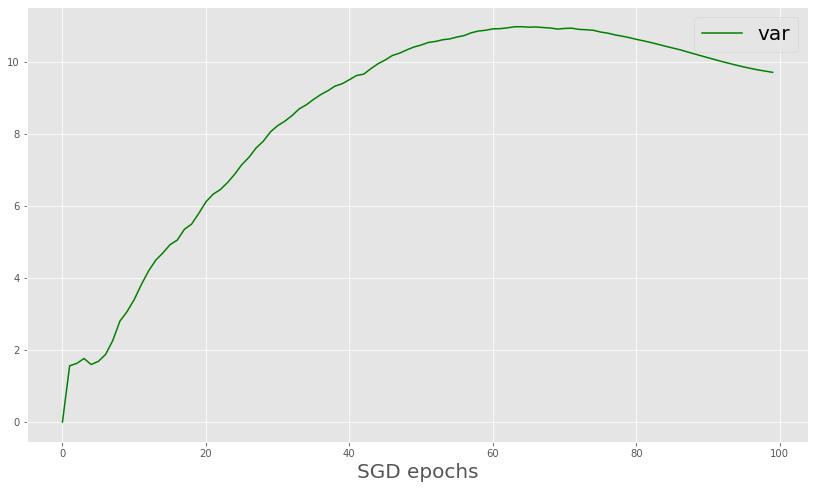
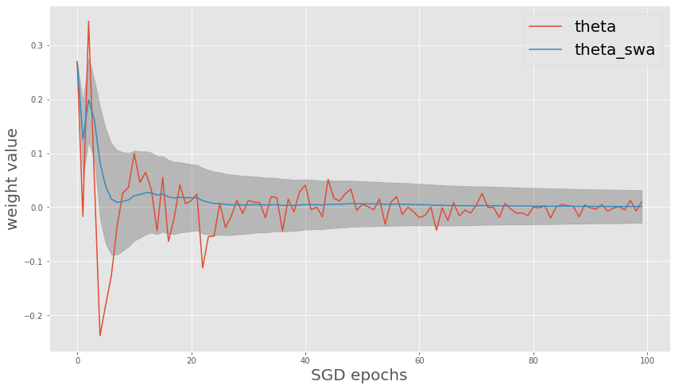
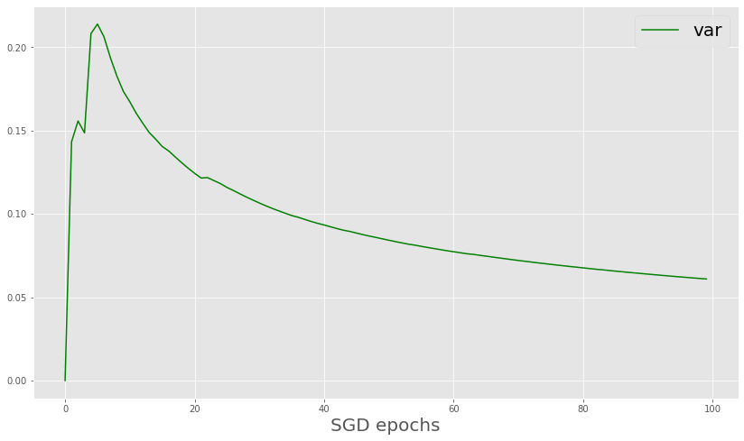

# SWAG

[A simple baseline for bayesian uncertainty in deep learning](https://arxiv.org/abs/1902.02476) suggests the bayesian inference using stochastic weight averaging(SWA) with Gaussian-modeled weights(SWAG).

# Uncertainty of unstable weight

    

    

    

# Uncertainty of converged weight
    

    
    

    

